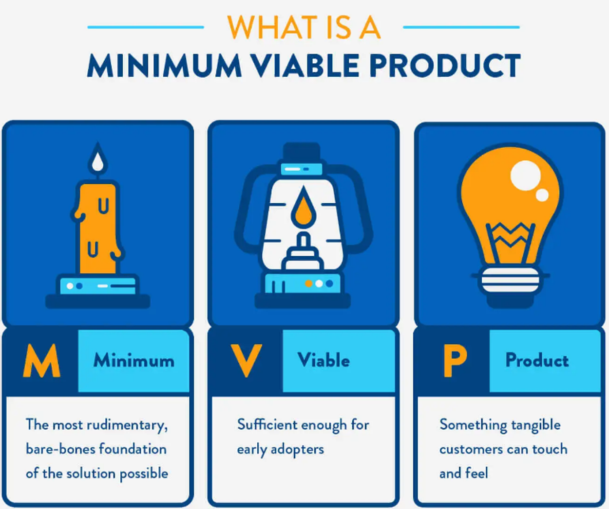
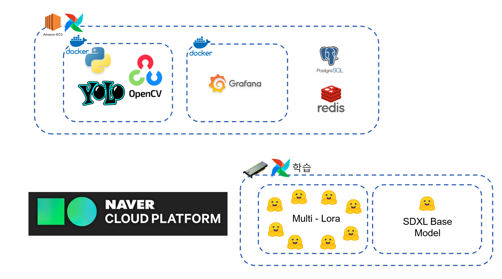

## 기획안

---

# [스윗한 형제들] 기획안

# 주제: [DE+DS] (주) 스위트앤데이터 - Stable Diffusion 기반 사진 서비스 고도화 / I2I 서비스 MVP 개발

## 팀 명: 스윗한 형제들

### 팀원: 강동훈(DS), 지주영(DS), 박사무엘(DS), 정양섭(DE), 남궁맑음(DE), 김아진(DE)

---

## 문제 배경 및 정의

### 문제 정의

- 정의:
  
  - Image to Image AI 모델과 MVP 데모 만들기
  

- 웹 I2I AI MVP 데모
  
  - 사용자의 img를 받아 “시현하다” (사진관) 같은 프로필 img 나오게 하는 것이 목표.
    - cool tone & warm tone 을 적용 & 자신에게 맞는 프로필 만들기

---

### 활용 방안 및 기대 효과

- 이 분야를 통해 사용자들은 다양한 스타일의 이미지나 생성할 수 있습니다. 이는 창의적인 사용자의 사진이나 새로운 표현 방식을 탐구하는데 도움을 준다.
- 사용자들은 개인적인 크리에이티브 작업, 디지털 아트, 광고 산업 등 다양한 분야에서 활용 가능하다.
  - (프로필 사용 사원증, 학생증)

### 문제 해결의 필요성

- 너무 많은 촬영 리소스가 소요됩니다.(비용+노동)
- 비 금전적 제약적 요소있습니다. (물리적 / 시간적)
- MZ 세대의 사진관 이용건수가 늘어나며 미화된 자신의 모습에 관심이 많을 것입니다..
  - 인생 네컷, etc…

### 문제 해결의 필요성 - DE & DS

- 웹 I2I AI MVP 데모 구축해야 합니다.
- 비 정제 된 이미지를 올리는 Preprocess 패키지 가 필요합니다.
- Pipe-line 구축
  - DS를 위한 데이터의 preprocess, model training, and inference 등의 단계를 위한 원할한 연결 flow 만들어야 합니다.
    - 모델의 생산성 과 성능을 향상 시키는게 목적입니다.
- Prompt 가 중요한 이유
  - 우리가 원하는 방향으로 유도 하기 위해서는 지시하는 방식이 필요해지기 때문입니다.
- 모델 개발을 위한 diffusion API 구현이 필요 합니다.
- 효율적인 최적화 & 모니터링을 개발을 목표로 두고 있습니다.

---

- DE는 패키지를 만들고, API를 만드는 경험, 서비스를 serving 해보는 경험하고 가져 볼 수 있다.
- 효율적인 데이터 관리, 자동화하는 것을 경험 한다.
- DS는 Stable Diffusion을 통해 img2img 모델링 구축하는 경험 한다.
- 여러 모델들을 Fine-tunning 경험 한다.

---

## 데이터

### 활용 데이터 및 데이터 활용 계획

- Newjeans 의 멤버들의 image 를 활용 한다.

---

# 개발 계획 및 일정

### AI 모델 및 방법

⇒ 이러한 문제를 생성한 모델 - stable diffusion XL 을 이용해 해결.

⇒ 프롬프트를 통해 원하는 방향으로 이끌며 사진을 유도 & 생성.

- Stable Diffusion
- Stable diffusion Web UI
- LoRA 유저 학습
- LoRA 와 Dreambooth가 적용된 모델 (베이스 모델)
- ControlNet 을 통해 pose 구현

### 평가

- 본인 유사도에 크게 의미를 둠.
  - == 정성적 평가
    - 여러 명의 사진을 통해 (정확도 파악)

### 데이터 아키텍쳐 및 파이프라인 구축 계획 - 추가 필요

- 서버 2개로 구축
  - Training purpose
  - Docker - Grafana, redis, postgreSQL
    - preprocess, raw, LoRa, ControlNet, ,result 적재
- Naver Cloud
  - Data Base

### 개발 일정 - 추가 필요

- 1st week
  - stable diffusion 논문 study & Web UI 사용
- 2nd week
  - Prompt Engineering study & Pre-process
- 3rd week
  - Stable diffusion modeling - 1 & Pipe-line Building -1
- 4th week
  - Stable diffusion modeling - 2 & Pipe-line Building -2
- 5th week
  - Pipe-line Building -3 & Optimization
- 6th week
  - serving MVP

---

## 역할 배분 - Credit

## DS

- DS
  
  강 동훈
  
  - Multi - LoRA
  
  박 사무엘
  
  - DS_팀장, 서기, base model - fine tune
  
  지 주영
  
  - 프롬프트, base model - fine tune

## DE

- DE
  
  김 아진
  
  - 전처리
  
  남궁 맑음
  
  - DE_팀장, 전처리
  
  정 양섭
  
  - 전처리, Git maintanance, 데이터 시각화
