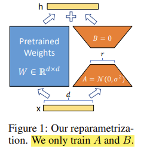
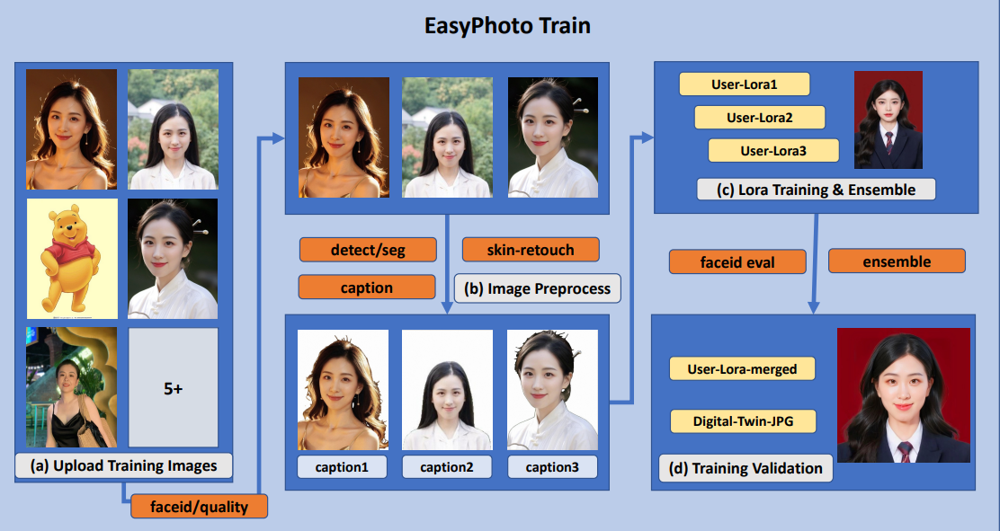
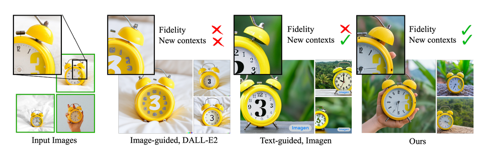
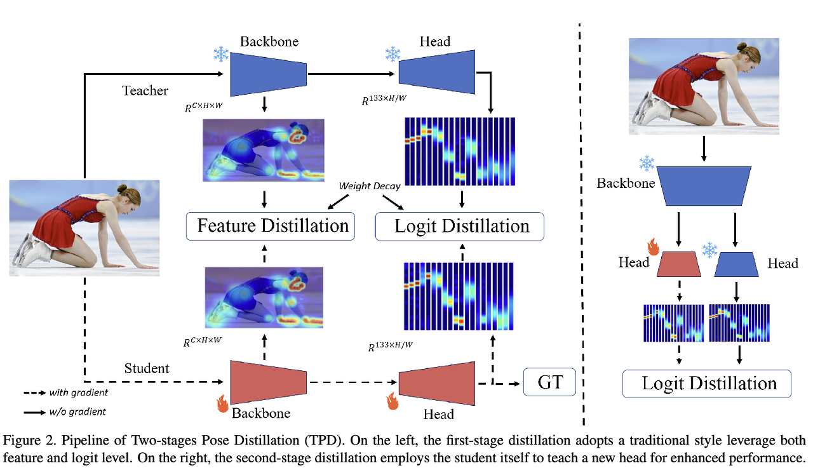

# [스윗한 형제들]

---


<p align="center"></p>


## **[DE+DS] Stable Diffusion 기반 I2I 서비스 MVP 개발**

- 2023년 이어드림스쿨3기에서 진행된 기업연계 프로젝트입니다.

- 연계기업으로부터 Stable Diffusion에 대한 주제를 받아 프로젝트를 진행하였습니다.

  

### 팀원: 강동훈(DS), 지주영(DS), 박사무엘(DS), 정양섭(DE), 남궁맑음(DE), 김아진(DE)
     

---

# Overview

### 문제 정의

- MVP 란?
    - 최소 기능 제품으로써 데모버전을 통해 구현 가능성과 대중의 관심도를 확인할 수 있는 시제품을 의미한다.
    
    
---


### 문제 해결의 필요성


- SNS에 인기 많은 스튜디오 프로필 사진
    - 저연령층의 관심도 꾸준히 수요가 있습니다.
    
- 너무 많은 촬영 리소스가 소요됩니다.(비용+노동)

- 이렇게 많은 관심을 받는 AI 생성 사진 토픽
    - MZ 세대의 사진관 이용건수가 늘어나며 미화된 자신의 모습에 관심이 많습니다.
        - 인생 네컷, etc…
    
- 이미 다른 기업들도 시작을 하고 있는 AI 생성 시장

    ---

    

- 저희는 ‘5주’라는 짧은 시간안에 I2I 서비스 기반을 다른 기업들처럼 구현을 해보고자 도전하게 되었습니다.
- 이미 만들어진 서비스와는 차별성을 두기 위해 프로필 사진의 “pose” 와 “filter-tone”을 추가로 구현하였습니다.


### 문제 해결의 필요성 - DE & DS

문제를 해결하기 위한 과정들로는

- 서비스를 띄울 WEB server 구축
- Pipe-line  구축
    - 전체적인 Inference 과정을 위한 데이터의 원할한 flow 연결.
        - 모델의 생산성 과 성능을 향상 시키는게 목적
- 좋은 방향으로 유도하는 모델의 Prompt
    - 우리가 원하는 방향으로 유도 하기 위해서는 올바른 방향의 prompt가 필요.
- 모델 개발을 위한 API 연동과 개발이 필요.

---


## 데이터

- 저희는 유명한 아이돌과 연예인들의 사진들을 이용하였습니다.
- 연예인들의 얼굴을 널리 알려졌기에, 저희가 연예인 얼굴의 유사도를 통해 모델의 성능을 측정하기에 용이하다고 판단하였습니다.
  
    ### 평가
    
    정성적인 평가를 통해 모델의 성능을 측정했습니다. 
    
    - 여러 연예인 사진을 통해 좋은 성능의 prompt, 모델, 파라미터를 측정했습니다.


---

# 개발 계획

### AI 모델 및 방법

⇒ Stabel Diffusion Web UI를 이용 (A1111)

- Stable diffusion Web UI
- Stable Diffusion base model
- EasyPhoto
    - Web UI 안에서 LoRA train
- ControlNet
    - T2I; pose 생성
    - Upscale; resample 과 detail up
- Adetailer


### 개발 일정
아래는 저희가 수행한 프로젝트의 개발 주차 와 개발 과정입니다.

- 1st week
    - stable diffusion 논문 study, Base model research & Web UI 사용
- 2nd week
    - Prompt Engineering & Pre-process
- 3rd week
    - Stable diffusion modeling & LoRA train & Prompt research - 1 & Gradio
- 4th week
    - Stable diffusion modeling & LoRA train & Prompt research  - 2 & API
- 5th week
    - Model & Prompt & Hyperparameter Optimization

더 자세한 개발 과정은 프로젝트 "Roadmap"을 통해 확인 가능합니다.
---


## 파이프라인 구조


1. ***T2I***
**user의 얼굴 학습**
user의 이미지를 받아 학습을 진행하여 LoRA를 만든뒤, 저희가 만든 Prompt를 기반으로 **ControlNet 기법**을 통해 생성의 마지막단에 Conditioning을 추가하여 Pose를 같이 구현합니다.
**보정**
Adetailer를 통해 보정할 부분을 Detection model; Yolov8 모델을 통해 얼굴과 손을 dection을 진행하고, 보정하는 부분 만을 **Inpainting 기법**을 통해 inpaint 할 부분에 전용 Prompt를 따로 주어, TextToImg 단계에서 같이 생성합니다.

2. ***I2I***
**미화 작업**
T2I의 output img를 i2i단에서의 base img 기반을 두어 생성을 시도합니다. I2I 단계에서는 T2I와 다른 Prompt를 두어서 Img의 느낌과 색감을 다르게 생성하는것에 초점을 두고 생성합니다. **하지만 Denoise를 크게 주지 않는선에서만 생성을 시도합니다.**
**보정**
T2I에서와 마찬가지로, Adetailer를 통해 같은 부위를 decting하고, 어그러지는 부위가 없도록 방지합니다.

3. ***Upscale***
**해상도 증가와 디테일 부분 캐치**
I2I의 output img를 그대로 base 기반으로 두고, **denoise를 아주 낮게** 설정한다. 그리고 ControlNet의 **tile_Resample** preprocess 기법을 통해 다시 샘플링을 따르면서 해상도를 늘리는 작업을 수행합니다.
**Script**
해상도를 올리 때 여러가지 기법들이 존재하지만, webUI 내의 script의 **Ultrasharp-upscale** 을 이용해 해상도를 올리면서 디테일한 부분들을 더 자연스럽게 생성하게끔 합니다.

## 데이터 파이프라인 구축


- 서버 2개로 구축
    - Server 1 : DS
        - Stable Diffusion WebUI
            - 이미지의 생성을 담당
                - WebUI API
                - ControlNet
                - Adetailer
                - EasyPhoto
                - Ultra-upscale script
                - Reactor
        - Flask API
            - WebUI API 와 Gradio API를 연결 하여 서버관의 교류를 담당
    - Server 2 : DE
        - user img 적재
        - Gradio
            - user 에게 보이는 Front 을 담당
---

# 과정
user 의 img를 받아 Image Generation 과정은 아래와 같습니다.

- Gradio를 Flask API를 이용해 Stdable Diffusion Web Ui 와 연동하여 프로세스한다.
- Graido를 통해 web의 Front로써 간단히 기능하게 됩니다.
- Stable Diffusion의 자체적인 API를 이용, 학습 및 추론을 수행합니다.

1. 유저의 이미지 10장을 통해 Easy-Photo의 train 후 user의 LoRA 생성한다.
2. 생성된 LoRA를 프롬프트에 추가한다
3. Generation Inference start
4. T2I로 이미지의 뼈대와 포즈 및 유저의 얼굴 생성한다.
5. user의 LoRA 와 손 등을 후보정 수행한다.
6. T2I의 output을 I2I로 처리하여 이미지의 tone-filter 를 denoise 미화작업을 수행한다. 
7. user의 LoRA 와 손 등을 다시 한번 더 후보정 수행한다. (이미지가 denoise를 통해 변한 부분을 변동없게 하기 위해서)
8. I2I를 다시 한번더 진행, 하지만 이번에는 Denoise를 낮게 주고, 해상도를 만을 높이면서 detail up을 목적으로 upscale 진행한다.
9. 최종적인 이미지를 생성후, Graido로 전송한다.
10. Gradio를 통해 user에게 출력하여 보여줍니다.

---
# Algorithms Summary

## T2I
**1. LoRA**
<p align="center"></p>
최근 chatGPT 열풍에 이어 LLM에 대한 인기가 매우 뜨겁습니다.
하지만, 여기서 문제점으로 언급된 것이 model을 fine-tuning할 때 모델의 파라미터가 너무 많다보니 리소스 제약이 크다는 점이였다.
LoRA 논문은 기존의 파라미터보다 훨씬 적은 파라미터를 가지고 튜닝하는 방법으로 통해서 리소스 제약에서 벗어나고 성능도 비슷하거나 더 높은 수준으로 훈련시킬 수 있도록 하는 수학적인 메커니즘을 소개했습니다.

cross-attention weight는 matrix에 저장됩니다. 행렬은 기본적으로 열과 행으로 나열된 숫자들에 불과합니다. LoRA 모델은 이러한 matrix에 weight를 추가함으로써 모델을 미세 조정합니다.
LoRA는 행렬을 랭크가 낮은(low-rank) 두 개의  행렬로 분해하기 때문에, 훨씬 더 적은 숫자를 저장할 수 있습니다.

예시로,
<p align="center"></p>
어떤 모델이 1000개의 행과 2000개의 열로 구성된 행렬을 가지고 있다고 가정하겠습니다. 그러면 그 모델 파일에는 2백만 (1000x2000)개의 숫자가 저장됩니다. LoRA는 이 행렬을 1000x2 행렬과 2x2000 행렬로 쪼갭니다. 이렇게 하면 총 6천개(1000x2 + 2x2000)의 숫자만 필요하고, 따라서 원래의 행렬에 비해 1/333 으로 줄어듭니다.이 때문에 LoRA 파일의 크기가 훨씬 작은 것입니다.

**2. EasyPhoto**
|

논문의 저자는 Gradio 라이브러리를 기반으로 구축된 브라우저 인터페이스를 갖추고 있어 Stable Diffusion 모델을 위한 대화형 및 사용자 친화적인 인터페이스를 제공합니다.

첫째, EasyPhoto 프레임워크는 얼굴 LoRA 또는 낮은 순위 적응 모델을 온라인으로 훈련하기 위해 몇 개의 이미지를 업로드하여 디지털 도플갱어를 생성하도록 사용자에게 요청합니다. LoRA 프레임워크는 하위 적응 기술을 사용하여 확산 모델을 신속하게 미세 조정합니다. 이 과정을 통해 기반 모델은 특정 사용자의 ID 정보를 이해할 수 있습니다. 그런 다음 훈련된 모델은 간섭을 위해 기준 안정 확산 모델에 병합 및 통합됩니다. 또한 간섭 과정에서 모델은 간섭 템플릿의 얼굴 영역을 다시 칠하기 위해 안정적인 확산 모델을 사용하고 다양한 ControlNet 장치를 사용하여 입력 이미지와 출력 이미지 간의 유사성을 검증합니다. 

요약하자면, EasyPhoto 프레임워크

1. 생성된 이미지의 얼굴 충실도를 유지하기 위해 여러 LoRA 모델을 통합하여 LoRA 모델을 훈련하는 새로운 접근 방식을 제안합니다. 
2. 다양한 강화 학습 방법을 사용하여 얼굴 신원 보상을 위한 LoRA 모델을 최적화합니다. 이는 학습 이미지와 생성된 결과 간의 신원 유사성을 향상시키는 데 더욱 도움이 됩니다. 
3. 높은 심미성과 유사성을 갖춘 AI 사진 생성을 목표로 하는 이중 단계 인페인트 기반 확산 프로세스를 제안합니다. 

2번째를 보시다시피 프레임워크는 먼저 사용자에게 훈련 이미지를 입력하도록 요청한 **다음 얼굴 decting** 수행하여 얼굴 위치를 감지합니다. 그 후에, 얼굴 영역에만 초점을 맞춘 사전 정의된 특정 비율을 사용하여 입력 이미지를 Crop 합니다.
그런 다음 preprocess 모델을 통해, 이미지를 미화와 돌출된 이미지를 처리합니다.
마지막으로, LoRA 모델을 훈련함으로써 사용자별 얼굴 특성을 보다 효과적이고 정확하게 이해할 수 있는 능력을 갖추게 됩니다.

또한 training 단계에서 프사용자 입력 이미지와 훈련된 LoRA 모델에 의해 생성된 확인 이미지 사이의 얼굴 ID 차이를 계산하는 중요한 검증 단계도 포함하여 수행합니다.
검증 단계는 LoRA 모델의 융합을 달성하고 궁극적으로 훈련된 LoRA  도플갱어, 즉 사용자의 정확한 **digital presentation**으로 변환됩니다.

최적의 Face_id 점수를 갖는 검증 이미지를 Face_id 이미지로 선택하고, 이 Face_id 이미지를 사용하여 간섭 생성의 신원 유사성을 향상시킵니다. 
앙상블 프로세스를 기반으로  maximum likelihood estimation as the objective 로써, LoRA 모델을 훈련하는 반면, 얼굴 신원 유사성을 유지하는 것은 downstream objective 입니다.

이 문제를 해결하기 위해 EasyPhoto 프레임워크는 강화 학습 기술을 사용하여 다운스트림 목표를 직접 최적화합니다.
결과적으로 LoRA 모델이 학습하는 얼굴 특징은 템플릿 생성 결과 간의 유사성을 향상시키는 개선을 보여주고 템플릿 전반에 걸친 일반화도 보여줍니다. 

**3. Dreambooth**

Dreambooth는 구글 연구진이 발표한 논문입니다. 
사용된 학습 방법의 이름으로 Imagen이라는 text-to-image 생성 모델을 어떤 subject에 대한 몇 장의 사진으로 Fine-tuning 하여  개인화된 text-to-image 생성 모델을 만들고 해당 <u>subject를 새로운 context에서 높은 fidelity로 이미지를 생성할 수 있게 해주는 학습 방법입니다.</u>

Dreambooth는 기존의 Fine-tuning에서 발생하는 다음 두 가지 문제를 해결하는 것을 목표로 제안된 방법입니다.
1. 주제 기반의 이미지 생성. 몇 장의 간단한 사진만으로  주제의 **시각적 특징**에 대한 **높은 fidelity를 유지**하면서 새로운 맥락의 사진을 합성하는 것입니다.
2. 몇 장의 이미지로 text-to-image diffusion모델을 fine-tuning 하면서도, **기존 모델의 Semantic knowlege를 보존**하는 것입니다.

위 내용을 통해 알 수 있듯이, Dreambooth는 기존의 Fine-tuning과는 달리 적은 수의 이미지만으로 모델의 오염(overfitting, language drift) 없이 학습이 가능하기 때문에 개인이 더 손쉽게 fine-tuning이 가능하다는 장점이 있습니다.

Dreambooth원리의 비밀은 class name에 있습니다.
Dreambooth는 class image(Regularization image, 정규화 이미지)를 통하여 해결 했습니다. 

학습하고 싶은 이미지인 A [v] dog에 대한 input image를 학습함과 동시에 기존 모델을 이용하여 출력한 A dog 라는 class name에 대한 이미지인 class image를 같이 학습하여 기존 모델이 가진 class name에 대한 지식을 잊지 않도록하게합니다.
추가적인 방법으로는, Dreambooth는 학습할 때 사용하는 손실함수로 class-specific prior preservation loss 라는 자체적인 손실 함수를 이용하였습니다.


## I2I
**1. Adetailer**
After Detailer란?
Stable Diffusion 사용시 얼굴 뭉개짐을 방지할 수 있는 확장 기능 입니다.
<p align="center">|</p>

1. 이미지 detection을 통해 부분을 인식합니다.
2. 인식한 부분을 새로 묘사한 프롬프트대로 이미지 생성하는 과정을 수행합니다.
	=> inpaint의 방식을 취함.
	Adetailer의 기능인Face restoration(얼굴 복원)과 After Detailer 모두 일그러진 얼굴을 복원하는데 사용할 수 있습니다. 
	Face restoration은 CodeFormer 혹은 GFGAN과 같은 별도의 AI 모델을 사용해 얼굴을 복원합니다. 
	반면 After Detailer의 경우, 이미지에 포함된 얼굴/손 등을 감지한 후, 확대하여 인페인트를 실시하고 다시 원래의 이미지 축척에 맞게 줄이는 방식으로 작동됩니다.

**2. ControlNet**
논문 이름: Adding Conditional Control to Text-to-Image Diffusion Models (ControlNet)
ControlNet은 Stable Diffusion 모델 을 제어하기 위한 신경망 모델로서, 단독으로는 사용할 수 없고, 다른 Stable Diffusion 모델과 함께 사용해야 합니다. 
Stable Diffusion에서 가장 기본적인 형태는 text-to-image, 즉 텍스트 프롬프트(prompt)를 조건부여(conditioning)로서 입력하면, 이를 바탕으로 이미지를 생성하는 것입니다. ControlNet은 조건부여를 하나 더 추가합니다. ControlNet에도 매우 많은 종류 존재하지만, 저희는 Openpose 와 tile_resample만을 이용했습니다.
인체의 자세를 감지하는 모델로는 Openpose 가 있습니다. 이 모델은 손, 발, 머리 등의 위치와 같은 인간의 자세를 추출하는 빠른 키포인트(keypoint) 감지 모델입니다.
<p align="center"></p>
<p align="center"></p>

위의 사진은 Openpose를 이용한 ControlNet 작업흐름입니다. Openpose는 입력된 이미지로 부터 키포인트를 추출하고, 이 키포인트의 위치를 포함하는 제어 맵(control map)으로 저정합니다. 이 제어 맵이 Stable Diffusion에 전달되어 텍스트 프롬프트와 함께 추가적인 조건부여로 사용됩니다. 이미지는 이처럼 두가지 조건부여에 기초하여 생성됩니다.
ControlNet은 학습 가능한 네트워크 모듈을 Stable Diffusion 모델의 핵심인 U-Net(잡음 예측기)의 여기 저기에 부착하는 방식으로 작동합니다. Stabel Diffusion 모델의 가중치는 훈련중 변경되지 않도록 고정됩니다. 학습 중에는 오직 부착된 모듈만 수정됩니다.


ControlNet은 zero-convolution
먼저, 부착된 네트워크 모듈의 가중치는 모두 0이므로, 새 모델은 학습되어 잠긴 모델을 활용할 수 있습니다.
1. 첫번째는 텍스트 프롬프트, 
2. 두번째는 Openpose 키포인트나 Canny외곽선과 같은 전처리 자료입니다. 
이런 방식으로 이들 두 가지 입력에 기초한 이미지를 생성하도록 학습할 수 있습니다. 이때, 각각의 전처리별 방법은 독립적으로 학습받게 됩니다.

ControlNet을 간단하게 묘사하면 다음과 같습니다.

diffusion model의 parameter를 복사하여 새로운 학습 프레임워크를 원래 parameter와 병렬로 구성한다. 
이를 각각 “trainable(학습 가능한) copy”와 “locked(학습 불가능한) copy”으로 지칭합니다.

Locked copy는 기존 network의 성능인 이미지 생성에 필요한 representation을 유지하고 있다고 생각할 수 있다.
Trainable copy는 conditional control을 위해 여러 task-specific dataset에 대해 학습되는 프레임워크입니다.
Locked copy와 Trainable copy는 zero convolution을 통해 서로 연결된다. Zero convolution 또한 학습 가능한 레이어에 속한다.

x가 들어가서 y가 나오는 구조는 diffusion process에 접목시키게 되면 특정 시점의 noised latent vector 
z_t가 input으로 들어가서 다음 시점의 noised latent vector 
z_{t−1}를 예측하는 것과 같다. 회색으로 된 neural network는 원래의 diffusion model로 파라미터가 고정된 채 변하지 않게끔 하면 사전 학습된 diffusion model의 이미지를 만드는 성능을 해치지 않고 가만히 놔둘 수 있습니다.

좌측의 얼어있는 친구는 가만 놔두고 우측의 열일하는 친구만 condition에 대해 학습한다고 생각하면 됩니다. Trainable copy이므로 fine-tuning 과정인데 원래의 parameter를 최대한 손상시키기 않겠다는 의도가 보이는 학습 구조가 됩니다.

**3. DwPose**
<p align="center"></p>

RTMPose를 뛰어넘는 논문 : Effective Whole-body Pose Estimation with Two-stages Distillation

DWPose의 Method로는 
two-stage pose distillation(TPD)를 제안했습니다.
그림에서도 볼 수 있듯, 2가지 단계로 구성됩니다. 
1단계에서는 feature 및 logit 수준에서 처음부터 student를 guiding 하는 pre-trained teacher가 있습니다. 
그 다음 2단계에서는 self-KD 방식을 사용합니다. 
자체 logit을 이용하여 레이블이 지정된 데이터 없이 head를 학습함으로서 간단하게 학습을 하되 상당한 성능 향상을 갖고옵니다. 

---
# Outputs

### MVP 


## 🎮 Getting Started

```markdown

***flask***
- webUI가 실행되고 있는 서버에 세팅 해야 한다.

***가상환경 실행 후***
pip install -r requirement.txt (in Final folder)

***flask 실행***
python main.py


***Gradio***
- flask 를 실행한 서버와 private ip 를 통해 통신이 가능한 서버에 설치 해야 한다. 

***Gradio 실행***
python main.py

1. stable_diffusion_webui를 다운  
2. 설치된 dir에 들어가서 다음 코드 실행
3. `python launch.py --nowebui --listen --port 7869`
4. train에서 main.py에서 305번째 줄을 본인 아이피 또는 0.0.0.0으로 수정 후 실행
5. web dir 의 main.py 에서 url을 train/main.py의 아이피와 포트에 맞게 수정 후 실행
6. 아이디:admin 비번:admin을 입력하면 아래의 사진과 같이 나옴
7. 이미지를 전부 넣고 option값을 원하는 대로 수정한다. 그 후 generate 버튼을 누르면 이미지가 result 탭에 생성된다.
```


## Output

- **장원영 (아이브)**

||


- **IU**

||


- **카리나 (Aespa)**

||

---

## Credit

## DS

- DS
  
    강 동훈
    
    - LoRA train, base model, LoRA Research
    
    박 사무엘
    
    - DS_팀장, 서기, base model, Prompt, LoRA Train, presentation, model base script, optimization
    
    지 주영
    
    - Prompt, base model, Prompt Research, optimization

## DE

- DE
  
    김 아진
    
    - 전처리, 자료 수집, developing
    
    남궁 맑음
    
    - DE_팀장, 전처리, 온프레미스 서버 환경 구축, Flask API, presentation, developing
    
    정 양섭
    
    - 전처리, Gradio, API connect, Flask API, developing, optimization

---