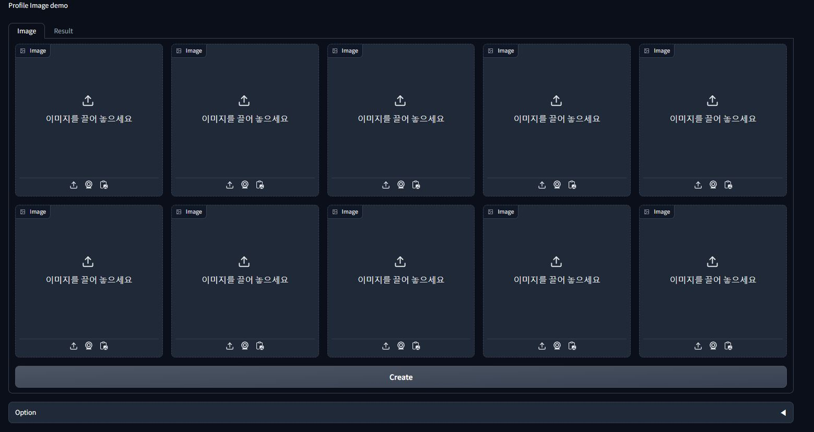

# 사용법

1. stable_diffusion_webui를 다운  
2. 설치된 dir에 들어가서 다음 코드 실행
   1. `python launch.py --nowebui --listen --port 7869`
3. train에서 main.py에서 305번째 줄을 본인 아이피 또는 0.0.0.0으로 수정 후 실행
4. web dir 의 main.py 에서 url을 train/main.py의 아이피와 포트에 맞게 수정 후 실행
5. 아이디:admin 비번:admin을 입력하면 다음과 같이 나옴

6. 이미지를 전부 넣고 option값을 원하는 대로 수정한다. 그 후 generate 버튼을 누르면 이미지가 result 탭에 생성된다. 

# 과정

- Gradio를 Flask API를 이용해 Stdable Diffusion Web Ui 와 연동하여 프로세스한다.
- Graido를 통해 web의 Front로써 간단히 기능하게함.
- Stable Diffusion의 자체적인 API를 이용, 학습 및 추론

1. 유저의 이미지 10장을 통해 Easy-Photo의 train 기능을 이용후 유저의 LoRA 생성
2. 생성된 LoRA를 프롬프트에 추가
3. Generation Inference start
4. T2I로 이미지의 뼈대와 포즈 및 유저의 얼굴 생성,
5. T2I의 output을 I2I로 처리하여 filter 와 후보정을 시도
6. I2I를 다시 한번더 진행, 하지만 이번에는 Denoise를 낮게 주고, 해상도를 만을 높이면서 detail up을 목적으로 upscale 진행
7. 최종적인 이미지를 생성후, Graido로 전송 유저에게 show.

